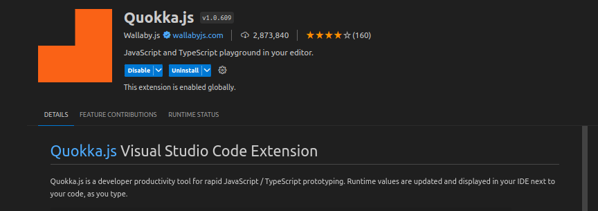

# javascript
This repo is mainly for testing out javascript via the browser.

By going to the index.html file and opening it as a live server.

Trying to get the inner workings of vanilla javascript.

# Quokka
You can also use this as a vscode extension to run js within the vscode terminal

Simply look for Quokka.js in the extensions and install it.

To start Quokka simply go to the command palette.

Then type Quokka start,select in current folder

Then boom 💥 you are all set.

